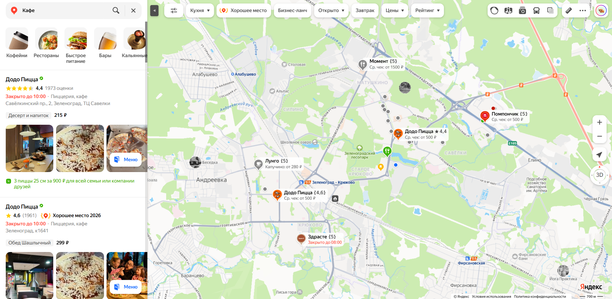
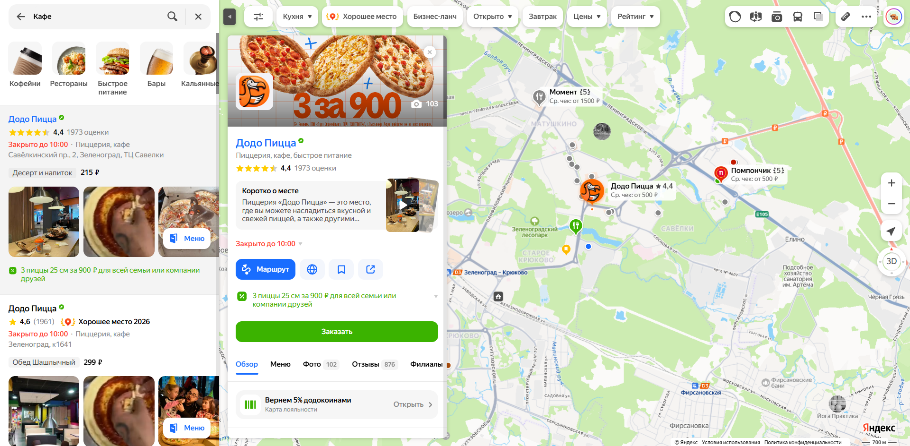
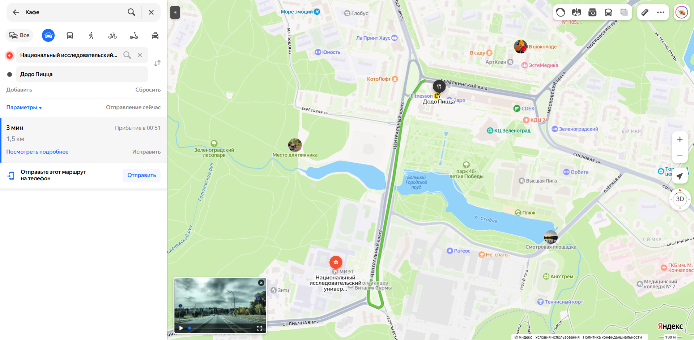
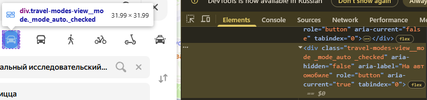
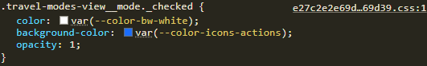
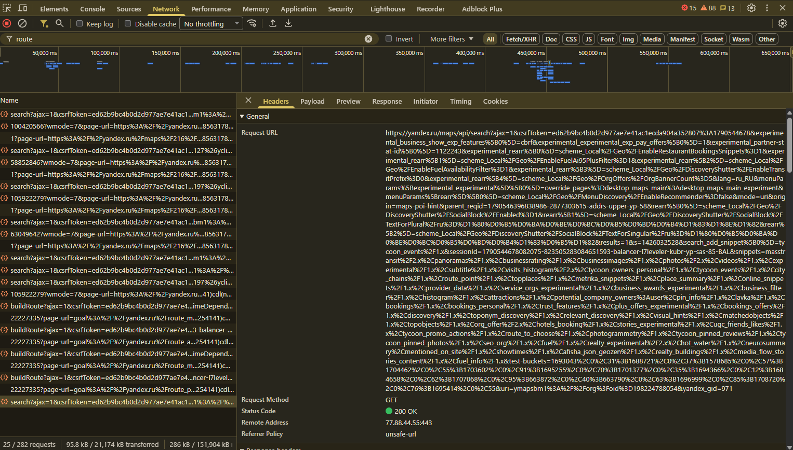
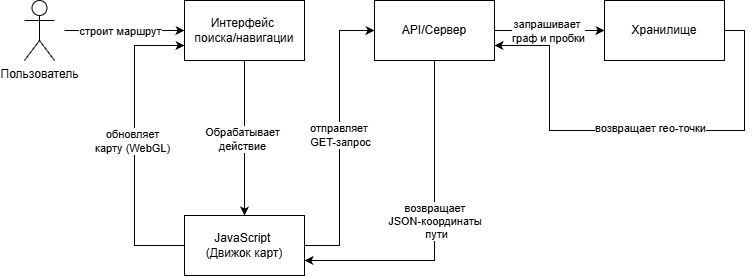
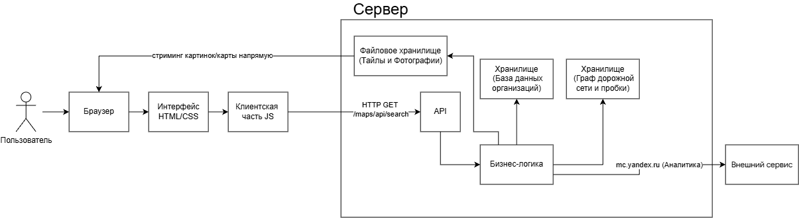

# Анализ информационной системы

## 1. Описание системы

Название: Яндекс Карты

Ссылка: https://yandex.ru/maps

Назначение:
Яндекс Карты — геоинформационный и поисково-информационный картографический сервис, предназначенный для поиска объектов на карте, получения справочной информации об организациях, мониторинга дорожной ситуации и построения оптимальных маршрутов без необходимости использования бумажных карт или сторонних справочников.

Целевая аудитория:

- Пешеходы и пассажиры общественного транспорта, планирующие свои поездки.
- Автомобилисты и водители коммерческого транспорта.
- Пользователи, ищущие конкретные организации, магазины или услуги.
- Бизнес-пользователи и маркетологи.
- Туристы и исследователи новых локаций.

Основные возможности:

- Отображение интерактивной карты мира с высокой детализацией.
- Поиск адресов, географических объектов и организаций.
- Построение автомобильных, пешеходных, велосипедных и транспортных маршрутов.
- Отображение дорожной ситуации и пробок в реальном времени.
- Просмотр панорам улиц и 3D-моделей зданий.
- Предоставление справочной информации об организациях (отзывы, контакты, график работы).
- Сохранение закладок и управление списками мест в личном кабинете.

Выбранный сценарий:
Поиск организации и построение маршрута.

В рамках сценария пользователь открывает поисковую строку, вводит запрос, выбирает подходящую организацию из списка, изучает её карточку и прокладывает до неё оптимальный маршрут от исходной точки.

## 2. Анализ пользовательского интерфейса

### 2.1. Основные страницы и разделы

В рамках лабораторной работы исследуется информационная система Яндекс Карты — картографический веб-сервис.

В системе используются следующие основные страницы и разделы:

- Главная страница Яндекс Карт с интерактивной картой.
- Страница авторизации (Яндекс ID).
- Личный кабинет пользователя (Мои места).
- Панель поиска и категорий.
- Список результатов поиска.
- Карточка выбранной организации.
- Панель маршрутизации.
- Разделы отзывов и фотографий организации.
- Компонент выбора слоев карты.
- Панель настроек интерфейса.

Часть разделов, включая сохраненные закладки, историю поездок и персональные подборки, доступна только после авторизации пользователя.

### 2.2. Ключевые элементы интерфейса

| Элемент интерфейса             | Назначение                                        |
|--------------------------------|---------------------------------------------------|
| Логотип Яндекс Карты           | Переход на главную страницу или сброс поиска      |
| Поисковая строка               | Ввод адресов, названий организаций и категорий    |
| Панель категорий               | Фильтрация объектов по назначению и типу          |
| Интерактивная карта            | Отображение структуры, дорог и гео-меток объектов |
| Кнопка «Маршруты»              | Внутри карточки организации запускает режим пути  |
| Список результатов             | Просмотр найденных по запросу объектов            |
| Карточка организации           | Отображение подробных данных и контактов объекта  |
| Кнопки выбора транспорта       | Иконки (авто, автобус, пешком) в верхней панели    |
| Кнопки масштабирования         | Изменение масштаба отображения карты (+/-)        |
| Индикатор пробок               | Отображение текущей загруженности дорог в баллах  |
| Кнопка «Сохранить»             | Добавление организации в закладки пользователя    |
| Панель слоев карты             | Переключение режимов (Схема, Спутник, Панорамы)   |

### 2.3. Выполнение пользовательского сценария

Выбранный сценарий: поиск организации и построение маршрута в Яндекс Картах.

Для выполнения сценария использовался открытый веб-интерфейс сервиса Яндекс Карты.

Последовательность действий:

1. Открыть сайт Яндекс Карт.
2. При необходимости выполнить авторизацию для доступа к закладкам.
3. Найти элемент поисковой строки в интерфейсе.
4. Ввести поисковый запрос (например, «кафе»).
5. Нажать кнопку поиска или клавишу Enter.
6. Выбрать подходящую организацию из появившегося списка (например, Додо Пицца).
7. Открыть карточку организации для изучения деталей.
8. Найти кнопку «Маршрут» синего цвета внутри карточки.
9. Открыть панель построения маршрута.
10. Ввести адрес отправления (Точка А) или выбрать текущую геопозицию.
11. Найти нужный вид транспорта на панели (например, автомобильный).
12. Выбрать оптимальный вариант пути из предложенных.
13. Проверить, что линия маршрута появилась на интерактивной карте.
14. При необходимости изучить текстовую инструкцию к маршруту.

В результате выполнения сценария до выбранной организации был успешно проложен оптимальный маршрут.

### 2.4. Компоненты, участвующие в сценарии

| Компонент интерфейса      | Назначение                                        | Этап сценария |
|---------------------------|---------------------------------------------------|---------------|
| Поисковая строка          | Позволяет пользователю ввести текстовый запрос     | 3–5           |
| Боковая панель поиска     | Предоставляет доступ к списку найденных мест      | 5–6           |
| Карточка организации      | Позволяет изучить контакты и запустить маршрут    | 6–8           |
| Панель маршрутизации      | Позволяет настроить точки А и Б и тип транспорта  | 8–11          |
| Кнопки выбора транспорта  | Позволяют переключать алгоритмы расчета путей     | 11            |
| Интерактивная карта       | Отображает текущую гео-позицию и линию пути       | 12–13         |
| Список вариантов пути     | Показывает время в дороге и расстояние            | 12–13         |
| Панель шагов маршрута     | Позволяет детально изучить повороты и пересадки   | 14            |

### 2.5. Скриншоты

#### Скриншот 1. Поиск организации

На скриншоте показан ввод запроса в поисковую строку и список найденных результатов на боковой панели.

#### Скриншот 2. Карточка организации

На скриншоте отображена открытая карточка выбранного заведения с подробной информацией и кнопкой «Маршрут».

#### Скриншот 3. Построенный маршрут

На скриншоте показан результат выполнения сценария — оптимальный путь проложен и отображается на интерактивной карте.

### 2.6. Вывод

В ходе анализа пользовательского интерфейса Яндекс Карт были определены основные разделы системы, ключевые элементы управления и компоненты картографического движка.

Выбранный сценарий состоит из следующих основных этапов:

- переход на главную страницу сервиса;
- ввод поискового запроса;
- выбор организации из списка;
- изучение карточки объекта;
- открытие панели маршрутов;
- выбор точек отправления и прибытия;
- выбор типа передвижения;
- проверка результата на карте.

Пользовательский интерфейс Яндекс Карт построен вокруг концепции SPA (Single Page Application) и динамической интерактивной карты, которая выступает рабочей областью. Для выполнения сценария пользователю не требуется переходить на другие веб-страницы — все панели открываются поверх карты.

## 3. Анализ клиентской части

### 3.1. Исследование HTML-структуры

Для анализа был выбран элемент интерфейса кнопка «На автомобиле» в верхней панели видов транспорта Яндекс Карт.

Элемент используется для изменения режима передвижения и пересчета маршрута.

Основные характеристики элемента:

- HTML-тег: `
...
`
- CSS-классы: `travel-modes-view__mode`, `travel-modes-view__mode_auto_checked`, отвечающие за состояние активности и стилизацию иконки автомобильного транспорта
- Значение роли: `role="button"` (семантическая роль кнопки для интерактивного взаимодействия)
- Вложенные элементы: SVG-графика иконки автомобиля

Скриншот HTML-структуры:

### 3.2. Исследование CSS

Для выбранного активного элемента были обнаружены CSS-классы, определяющие его внешний вид и выделение цветом.

Основные свойства:

| Свойство          | Значение                          | Назначение                                      |
|-------------------|-----------------------------------|-------------------------------------------------|
| `color`           | `var(--color-bw-white)`           | Устанавливает белый цвет иконки внутри кнопки   |
| `background-color`| `var(--color-icons-actions)`      | Задает синий фоновый цвет для активной кнопки   |
| `opacity`         | `1`                               | Задает полную непрозрачность элемента           |

Скриншот CSS-стилей:

### 3.3. Исследование JavaScript

JavaScript используется для реализации высокоинтерактивного графического интерфейса карты.

При нажатии на иконку вида транспорта срабатывает событие клика, которое обрабатывается клиентскими JavaScript-сценариями и инициализирует асинхронный сетевой запрос.

JavaScript отвечает, в частности, за:

- перехват действий пользователя (клик по кнопкам выбора транспорта);
- изменение состояния CSS-классов интерфейса в реальном времени;
- сбор параметров маршрутизации и отправку асинхронных поисковых запросов;
- динамическое обновление содержимого панелей без перезагрузки всей страницы.

Скриншот сетевого вызова и инициализации URL при взаимодействии с кнопкой:

### 3.4. Загружаемые resources

При открытии интерактивной карты браузер загружает различные ресурсы, необходимые для работы приложения.

Были обнаружены следующие типы ресурсов:

| Тип        | Пример            | Назначение                        |
|------------|-------------------|-----------------------------------|
| Document   | HTML-страница     | Загрузка стартовой структуры      |
| Script     | JavaScript-файлы  | Работа интерактивного движка карты|
| Stylesheet | CSS-файлы         | Стилизация панелей и элементов    |
| Image      | PNG/SVG/Тайлы     | Отрисовка подложки карты и иконок |
| Font       | Шрифты WOFF2      | Отображение фирменных шрифтов     |
| Fetch/XHR  | Запросы к API     | Динамический поиск и расчет путей |

### 3.5. Анализ сетевых запросов

При открытии карты браузер выполняет огромное количество сетевых запросов.

Они используются для загрузки графических плиток карты, шрифтов, стилей и обмена поисковыми данными с сервером.

Примеры обнаруженных запросов:

| Метод                                                                   | Тип        | Статус | Назначение               |
|-------------------------------------------------------------------------|------------|--------|--------------------------|
| GET /maps/                                                              | Document   | 200    | Стартовая загрузка сервиса|
| GET /maps/api/script/maps.js                                            | Script     | 200    | Загрузка ядра карт       |
| GET /tiles/v2/common/style.css                                          | Stylesheet | 200    | Загрузка базовых стилей   |
| GET /maps/api/search                                                    | Fetch/XHR  | 200    | Выполнение поиска объектов|

### 3.6. Запрос при выполнении сценария

При выполнении сценария «Поиск организации и построение маршрута» в разделе Network был перехвачен сетевой запрос, связанный с поиском компании и получением её гео-данных для последующей маршрутизации.

Основные параметры:

- Метод: `GET`
- Url: `https://yandex.ru`
- Тип: `Fetch/XHR`
- Статус: `200 OK`
- Данные запроса: идентификационные токены CSRF, уникальный ID организации (oid) и параметры текущего региона отображения карты
- Ответ: структурированные JSON-данные, содержащие гео-координаты заведения, метаданные компании (меню, отзывы, фотографии), необходимые клиентской части для отображения карточки

Скриншот запроса:

### 3.7. Вывод

В ходе анализа клиентской части Яндекс Карт были изучены:

- HTML-структура ключевого элемента управления;
- CSS-классы и основные стили оформления;
- JavaScript-файлы и их роль в работе интерфейса при клике;
- загружаемые ресурсы;
- сетевые запросы браузера.

Установлено, что клиентская часть отвечает за отображение карты, сбор параметров сценария, обработку действий пользователя и асинхронное взаимодействие с сервером.

При прокладке маршрута пользователь выполняет действие в интерфейсе, JavaScript считывает и изменяет классы элементов, а клиентская часть выполняет сетевые запросы для получения гео-данных организации и прокладываемой нити пути.

## 4. Анализ серверной части и API

### 4.1. Серверная часть

Серверная часть Яндекс Карт отвечает за операции, которые требуют сложной обработки и хранения данных на сервере.

В рамках выбранного сценария «Поиск организации и построение маршрута» можно предположить выполнение следующих серверных операций:

- полнотекстовый поиск по базе данных организаций с обработкой опечаток;
- геокодирование и сопоставление текстовых адресов с точными координатами;
- расчет кратчайших путей на масштабном дорожно-пешеходном графе;
- динамическое вычисление времени поездки с учетом пробок;
- проверка прав и сессий пользователя при сохранении мест.

Точная внутренняя реализация серверной части недоступна пользователю, поэтому часть выводов основана на наблюдаемых сетевых запросах и поведении системы.

### 4.2. Передаваемые данные

При работе интерактивной карты между браузером и сервером передаются различные данные.

В зависимости от выполняемого действия это могут быть:

- поисковые текстовые запросы пользователя;
- географические координаты точек А и Б (широта и долгота);
- идентификаторы компаний (ID организации в Яндекс Бизнесе);
- параметры фильтрации выдачи (рейтинг, время работы);
- данные пользователя и его активной сессии (Яндекс ID);
- выбранный режим передвижения.

Например, при переходе к карточке организации клиентская часть передает уникальный параметр `oid=198224788054` в строке URL, чтобы сервер однозначно определил запрашиваемый филиал.

Часть этих данных может передаваться в параметрах URL, заголовках или теле HTTP-запроса.

### 4.3. API и сетевое взаимодействие

В разделе Network были обнаружены запросы типа `Fetch/XHR`.

Они используются клиентской частью для обмена данными с сервером.

Пример наблюдаемого запроса:

| Параметр   | Значение                                                  |
|------------|-----------------------------------------------------------|
| Метод      | GET                                                       |
| Тип        | Fetch/XHR                                                 |
| URL        | /maps/api/search                                          |
| Статус     | 200 OK                                                    |
| Назначение | Запрос на получение полной информации об организации      |
| Данные     | Идентификатор организации, токены безопасности CSRF       |

API позволяет клиентской части отправлять структурированные параметры на сервер и получать готовый результат обработки.

Скриншот сетевого запроса:

### 4.4. Внешние сервисы

При работе Яндекс Карт браузер может обращаться не только к основному домену системы, но и к другим специализированным доменам.

Такие обращения могут использоваться для:

- быстрой доставки статичных скриптов и стилей (CDN);
- потокового стриминга графических плиток (тайлов) карты;
- загрузки медиа-контента и фотографий пользователей;
- сбора продуктовой аналитики.

В ходе анализа были обнаружены следующие внешние домены:

| Домен               | Назначение                         |
|---------------------|------------------------------------|
| core-renderer-tiles.maps.yandex.net | Потоковая отдача слоев карты       |
| avatars.mds.yandex.net | Загрузка фотографий организаций    |
| yastatic.net        | Сеть доставки контента (CDN)       |
| mc.yandex.ru        | Аналитика и сбор метрик ошибок     |

Если назначение домена точно определить невозможно, необходимо указать это в отчете.

### 4.5. Хранилища данных

Внутренние хранилища Яндекс Карт непосредственно из браузера не видны.

Однако по функциям системы можно предположить наличие нескольких типов хранилищ:

| Хранилище            | Предполагаемое назначение                                     |
|----------------------|---------------------------------------------------------------|
| Графовые базы данных | Хранение постоянно обновляемой сетки дорог для поиска путей   |
| Реляционные / NoSQL  | База данных организаций (контакты, отзывы, время работы)      |
| Объектное хранилище  | Хранение пользовательских фотографий и панорам улиц           |
| Браузерное хранилище | Хранение истории недавних поисков в LocalStorage пользователя |

Эти предположения основаны на функциональности системы. Точная технология хранения данных по результатам внешнего анализа не определяется.

### 4.6. Общая схема взаимодействия

На основании проведенного анализа можно представить упрощенную схему работы системы:

## 5. Описание пользовательского сценария

### 5.1. Выбранный сценарий

Название сценария: поиск организации и построение маршрута в Яндекс Картах.

Цель сценария: найти целевой объект на карте и проложить к нему визуальную нить пути.

### 5.2. Последовательность выполнения сценария

#### Этап 1. Пользователь открывает страницу

Пользователь переходит на сайт Яндекс Карт, инициализируя загрузку интерактивного интерфейса.

На этом этапе браузер скачивает и собирает базовые HTML-, CSS- и JavaScript-ресурсы, а также стартовые тайлы карты.

#### Этап 2. Пользователь выполняет поиск

Пользователь вводит текстовый запрос в строку поиска и отправляет его.

JavaScript перехватывает событие ввода и формирует асинхронный Fetch-запрос к поисковому API Яндекса.

#### Этап 3. Сервер обрабатывает поиск

Сервер принимает запрос, обращается к базе данных организаций и возвращает список подходящих мест с их координатами.

Клиентская часть обрабатывает этот список, выводит его на панель результатов и расставляет метки на карте.

#### Этап 4. Пользователь выбирает организацию

Пользователь кликает на нужную карточку из списка и нажимает кнопку «Маршрут».

Интерфейс переключается в режим маршрутизации, подготавливая поля для ввода начальной точки пути.

#### Этап 5. Клиентская часть взаимодействует с сервером

Пользователь указывает точку старта. Клиент собирает координаты обеих точек и тип транспорта, отправляя запрос к роутинг-API.

В запросе передаются точные географические параметры для расчета путей.

#### Этап 6. Сервер рассчитывает маршрут

Серверный микросервис на основе графа дорог и текущих пробок вычисляет несколько вариантов ломаной линии пути.

После обработки сервер возвращает массив географических точек и метаданных обратно в браузер.

#### Этап 7. Интерфейс отображает результат

JavaScript-движок карты принимает координаты пути и отрисовывает цветные нити маршрутов поверх карты через WebGL.

Пользователь видит готовый маршрут, время в пути и может начать движение.

### 5.3. Общая последовательность

Упрощенно сценарий можно представить следующим образом:

## 6. Построение архитектурной схемы

### 6.1. Архитектурная схема

Для демонстрационного варианта была построена упрощенная архитектурная схема информационной системы Яндекс Карты.

На схеме представлены основные компоненты:

- пользователь;
- браузер;
- пользовательский интерфейс;
- клиентская часть;
- API;
- серверная часть;
- хранилище данных;
- внешние сервисы.

Схема показывает направление взаимодействия между компонентами при выполнении сценария поиска объекта и построения пути до него.

### 6.2. Взаимодействие компонентов

Основные взаимодействия в системе:

1. Пользователь взаимодействует с поисковыми и навигационными панелями.
2. Браузер рендерит интерактивную карту и обрабатывает скрипты логики.
3. Клиентская часть считывает координаты и текстовые запросы пользователя.
4. Клиентская часть отправляет асинхронные HTTP-запросы к API.
5. Сервер обрабатывает входящие гео-координаты и поисковые ключи.
6. Сервер обращается к базам данных организаций и графу дорожной сети.
7. Сервер возвращает массивы точек маршрута и метаданных клиенту.
8. Клиентская часть отрисовывает цветные нити пути поверх карты.
9. Пользователь оценивает проложенный путь и время в дороге.

Дополнительно серверная часть и клиент взаимодействуют с CDN-серверами для стриминга тайлов карты и медиа-серверами для загрузки фотографий мест.

### 6.3. Архитектурная схема

